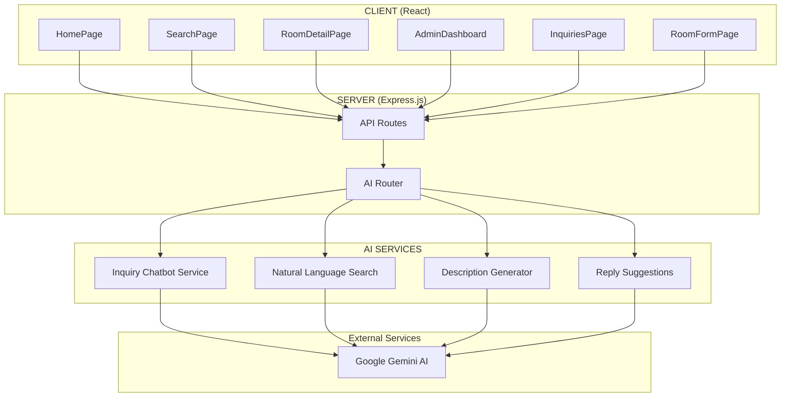

# AI Integration Plan for Windsor Residence

## Executive Summary

This document outlines a comprehensive plan to integrate Google Gemini AI into the Windsor Residence inquiry website. The integration aims to enhance user experience, automate administrative tasks, and improve lead conversion through intelligent automation.

---

## Current Architecture

```
┌─────────────────────────────────────────────────────────────────┐
│                        CLIENT (React)                           │
│  ┌──────────┐  ┌──────────┐  ┌──────────┐  ┌──────────────────┐ │
│  │HomePage  │  │SearchPage│  │RoomDetail│  │ AdminDashboard   │ │
│  └──────────┘  └──────────┘  └──────────┘  └──────────────────┘ │
└─────────────────────────────────────────────────────────────────┘
                              │
                              ▼
┌─────────────────────────────────────────────────────────────────┐
│                     SERVER (Express.js)                         │
│  ┌──────────┐  ┌──────────┐  ┌──────────┐  ┌──────────────────┐ │
│  │ /rooms   │  │/inquiries│ │ /admin   │  │   /messages      │ │
│  └──────────┘  └──────────┘  └──────────┘  └──────────────────┘ │
└─────────────────────────────────────────────────────────────────┘
                              │
                              ▼
┌─────────────────────────────────────────────────────────────────┐
│                    SUPABASE (PostgreSQL)                        │
│  ┌──────────┐  ┌──────────┐  ┌──────────┐  ┌──────────────────┐ │
│  │  rooms   │  │inquiries │  │  users   │  │    messages      │ │
│  └──────────┘  └──────────┘  └──────────┘  └──────────────────┘ │
└─────────────────────────────────────────────────────────────────┘
```

---

## Proposed AI Integration Architecture



---

## Feature 1: AI Inquiry Assistant (Chatbot)

### Overview

An AI-powered chatbot on the Room Detail Page that answers visitor questions in real-time, reducing bounce rates and qualifying leads before they submit formal inquiries.

### User Flow

```
Visitor views RoomDetailPage
        │
        ▼
┌───────────────────┐
│ Chat widget opens │
│ "Hi! How can I    │
│  help you today?" │
└───────────────────┘
        │
        ▼
┌─────────────────────────────────────────────────────────────┐
│ User types: "Is this room available for move-in next month?"│
└─────────────────────────────────────────────────────────────┘
        │
        ▼
┌─────────────────────────────────────────────────────────────┐
│ AI analyzes:                                               │
│ - Current room details (id, price, availability)          │
│ - Knowledge base about Windsor policies                    │
│ - Common FAQ patterns                                      │
└─────────────────────────────────────────────────────────────┘
        │
        ▼
┌─────────────────────────────────────────────────────────────┐
│ AI Response: "Yes! Room 204 is available for move-in on   │
│ July 1st. Would you like me to schedule a viewing or       │
│ submit a formal inquiry?"                                   │
└─────────────────────────────────────────────────────────────┘
        │
        ▼
┌─────────────────────────────────────────────────────────────┐
│ If qualified → Lead captured with conversation history    │
└─────────────────────────────────────────────────────────────┘
```

### Implementation Details

**Frontend (RoomDetailPage.jsx)**

- Add chat widget component: `AIChatWidget.jsx`
- States: minimized, expanded, loading, error
- Integration point: After room details load

**Backend (server/src/routes/ai.js)**

```
POST /ai/chat
  Body: { message, roomId, conversationHistory }
  Response: { reply, suggestedActions, shouldCaptureLead }
```

**AI Prompt Strategy**

- System prompt: Windsor Residence knowledge base
- Room context injection from database
- Fallback to human inquiry form for complex issues

### Files to Create/Modify

| File                                     | Action | Description           |
| ---------------------------------------- | ------ | --------------------- |
| `client/src/components/AIChatWidget.jsx` | Create | Chat UI component     |
| `client/src/pages/RoomDetailPage.jsx`    | Modify | Integrate chat widget |
| `server/src/routes/ai.js`                | Create | AI endpoint router    |
| `server/src/services/ai/chatbot.js`      | Create | Gemini chatbot logic  |
| `server/src/services/ai/prompts.js`      | Create | Prompt templates      |
| `server/src/config/gemini.js`            | Create | Gemini client config  |

---

## Feature 2: Natural Language Room Search

### Overview

Transforms the SearchPage from filter-based to conversational search. Users can type natural queries like "I need a quiet room with fast WiFi for a student budget" and receive AI-curated results.

### User Flow

```
SearchPage - User types in search bar
        │
        ▼
┌─────────────────────────────────────────────────────────────┐
│ "quiet room with wifi under 15000 for student"              │
└─────────────────────────────────────────────────────────────┘
        │
        ▼
┌─────────────────────────────────────────────────────────────┐
│ If query is natural language (contains intent/phrases):    │
│   → Send to AI for interpretation                           │
│ If query is keyword search:                                 │
│   → Use existing database search                           │
└─────────────────────────────────────────────────────────────┘
        │
        ▼
┌─────────────────────────────────────────────────────────────┐
│ AI Interpretation:                                          │
│ {                                                           │
│   "minPrice": 5000,                                        │
│   "maxPrice": 15000,                                       │
│   "keywords": ["quiet", "wifi", "student"],                │
│   "bedrooms": 1,                                           │
│   "intent": "budget_student_accommodation"                 │
│ }                                                           │
└─────────────────────────────────────────────────────────────┘
        │
        ▼
┌─────────────────────────────────────────────────────────────┐
│ Apply interpreted filters + semantic keyword search        │
│ → Display results on SearchPage                            │
└─────────────────────────────────────────────────────────────┘
```

### Implementation Details

**Frontend (SearchPage.jsx)**

- Add AI-powered search mode toggle
- Detect natural language patterns
- Show AI interpretation badge: "Showing rooms matching: quiet, wifi, under ₱15,000"

**Backend (server/src/routes/ai.js)**

```
POST /ai/interpret-search
  Body: { query }
  Response: {
    filters: { minPrice, maxPrice, bedrooms },
    keywords: string[],
    intent: string,
    explanation: string
  }
```

**AI Interpretation Strategy**

- Extract numeric constraints (price ranges, bedroom counts)
- Identify amenities from context (wifi → WiFi amenity)
- Detect user persona (student, family, professional)
- Preserve intent keywords for semantic matching

### Files to Create/Modify

| File                                             | Action | Description            |
| ------------------------------------------------ | ------ | ---------------------- |
| `client/src/pages/SearchPage.jsx`                | Modify | Add NL search input    |
| `client/src/components/SearchInterpretation.jsx` | Create | Show AI interpretation |
| `server/src/services/ai/searchInterpreter.js`    | Create | NL to filters logic    |

---

## Feature 3: Room Description Generator

### Overview

Admin tool that generates compelling room descriptions from structured data. Saves time and ensures consistent, marketing-ready content.

### User Flow

```
Admin opens RoomFormPage (create or edit mode)
        │
        ▼
┌─────────────────────────────────────────────────────────────┐
│ Admin fills basic specs:                                    │
│ - Bedrooms: 2, Bathrooms: 1, Area: 45sqm                   │
│ - Floor: 3, Unit: 301                                      │
│ - Amenities: WiFi, AC, Hot Shower, Parking                │
│ - Price: ₱18,000/month                                     │
└─────────────────────────────────────────────────────────────┘
        │
        ▼
┌─────────────────────────────────────────────────────────────┐
│ Admin clicks "Generate Description" button                 │
└─────────────────────────────────────────────────────────────┘
        │
        ▼
┌─────────────────────────────────────────────────────────────┐
│ AI generates:                                              │
│ "Welcome to your new home in Unit 301! This spacious 2-bedroom, │
│ 1-bathroom apartment offers 45sqm of comfortable living space │
 │ on the 3rd floor. Enjoy modern amenities including high-speed  │
 │ WiFi, air conditioning, hot shower, and convenient parking.    │
 │ Perfect for young professionals or couples seeking a peaceful   │
 │ retreat at ₱18,000/month."                                    │
└─────────────────────────────────────────────────────────────┘
        │
        ▼
┌─────────────────────────────────────────────────────────────┐
│ Admin reviews, edits if needed, saves                      │
└─────────────────────────────────────────────────────────────┘
```

### Implementation Details

**Frontend (RoomFormPage.jsx)**

- Add "Generate Description" button
- Show loading state while generating
- Allow manual editing of generated text

**Backend (server/src/routes/ai.js)**

```
POST /ai/generate-description
  Body: {
    bedrooms, bathrooms, area, floor, unitNumber,
    amenities[], price, existingDescription?
  }
  Response: { description: string, confidence: number }
```

### Files to Create/Modify

| File                                             | Action | Description            |
| ------------------------------------------------ | ------ | ---------------------- |
| `client/src/pages/admin/RoomFormPage.jsx`        | Modify | Add generate button    |
| `server/src/services/ai/descriptionGenerator.js` | Create | Description generation |

---

## Feature 4: Admin Reply Suggestions

### Overview

AI suggests reply templates for incoming inquiries, categorized by type, helping admins respond faster with consistent quality.

### User Flow

```
Admin views InquiryDetailPage
        │
        ▼
┌─────────────────────────────────────────────────────────────┐
│ Inquiry from: Maria Santos                                  │
│ Subject: "Questions about Room 205 availability"           │
│ Message: "Hi, I saw Room 205 on your website. Is it        │
│ available for August move-in? What's included in the       │
│ rent? Thank you!"                                           │
└─────────────────────────────────────────────────────────────┘
        │
        ▼
┌─────────────────────────────────────────────────────────────┐
│ AI Analysis:                                                │
│ - Category: "availability_pricing"                         │
│ - Sentiment: "positive_interested"                         │
│ - Key Topics: availability, August move-in, rent inclusion │
│ - Suggested Replies: [3 templates ranked by relevance]     │
└─────────────────────────────────────────────────────────────┘
        │
        ▼
┌─────────────────────────────────────────────────────────────┐
│ Admin sees suggestion panel:                                 │
│ "Based on this inquiry, here are suggested replies:"       │
│ [Use Template 1] [Use Template 2] [Use Template 3]         │
└─────────────────────────────────────────────────────────────┘
        │
        ▼
┌─────────────────────────────────────────────────────────────┐
│ Admin clicks template → Text populated in reply form       │
│ Admin edits if needed → Sends reply                        │
└─────────────────────────────────────────────────────────────┘
```

### Implementation Details

**Frontend (InquiryDetailPage.jsx)**

- Add AI suggestions panel
- Show category and sentiment indicators
- Template selection populates reply form

**Backend (server/src/routes/ai.js)**

```
POST /ai/suggest-reply
  Body: { inquiryId }
  Response: {
    category: string,
    sentiment: string,
    suggestions: [{ text: string, confidence: number }],
    keyTopics: string[]
  }
```

### Files to Create/Modify

| File                                           | Action | Description           |
| ---------------------------------------------- | ------ | --------------------- |
| `client/src/pages/admin/InquiryDetailPage.jsx` | Modify | Add suggestions panel |
| `server/src/services/ai/replySuggester.js`     | Create | Suggestion logic      |

---

## Technical Implementation Guide

### 1. Gemini API Client Setup

**File: `server/src/config/gemini.js`**

```javascript
const { GoogleGenerativeAI } = require("@google/generative-ai");

const genAI = new GoogleGenerativeAI(process.env.GEMINI_API_KEY);

const model = genAI.getGenerativeModel({
  model: "gemini-1.5-flash",
  generationConfig: {
    temperature: 0.7,
    maxOutputTokens: 1024,
  },
});

module.exports = { model };
```

### 2. Environment Variables

**File: `server/.env`**

```
# Add to existing .env
GEMINI_API_KEY=your_gemini_api_key_here
```

### 3. API Router

**File: `server/src/routes/ai.js`**

```javascript
const express = require("express");
const router = express.Router();
const { chatWithBot } = require("../services/ai/chatbot");
const { interpretSearch } = require("../services/ai/searchInterpreter");
const { generateDescription } = require("../services/ai/descriptionGenerator");
const { suggestReply } = require("../services/ai/replySuggester");

// All routes require admin auth for some endpoints
// Public endpoints: /ai/chat, /ai/interpret-search
// Admin-only: /ai/generate-description, /ai/suggest-reply

router.post("/chat", chatWithBot);
router.post("/interpret-search", interpretSearch);
router.post("/generate-description", generateDescription);
router.post("/suggest-reply", suggestReply);

module.exports = router;
```

### 4. Dependency Addition

**File: `server/package.json`**

```json
{
  "dependencies": {
    "@google/generative-ai": "^0.21.0"
  }
}
```

---

## Implementation Priority

| Priority | Feature               | Impact | Effort | Reason                                    |
| -------- | --------------------- | ------ | ------ | ----------------------------------------- |
| **1**    | Inquiry Chatbot       | High   | Medium | Direct user engagement, 24/7 availability |
| **2**    | NL Search             | High   | Medium | Core UX improvement                       |
| **3**    | Reply Suggestions     | Medium | Low    | Admin time savings                        |
| **4**    | Description Generator | Medium | Low    | Content creation efficiency               |

---

## Risk Considerations

| Risk                       | Mitigation                                             |
| -------------------------- | ------------------------------------------------------ |
| **API Cost Overrun**       | Implement caching, rate limiting, and usage monitoring |
| **Incorrect AI Responses** | Human fallback options, confidence thresholds          |
| **Response Latency**       | Loading states, async processing, timeout handling     |
| **API Key Exposure**       | Server-side only, never expose to client               |

---

## Next Steps

1. **Approve this plan** - Confirm which features to implement
2. **Set up Gemini API** - Add key to server environment
3. **Create AI router** - Backend endpoint structure
4. **Implement Feature 1** - Chatbot (highest impact)
5. **Implement Feature 2** - NL Search
6. **Implement Features 3-4** - Admin tools
