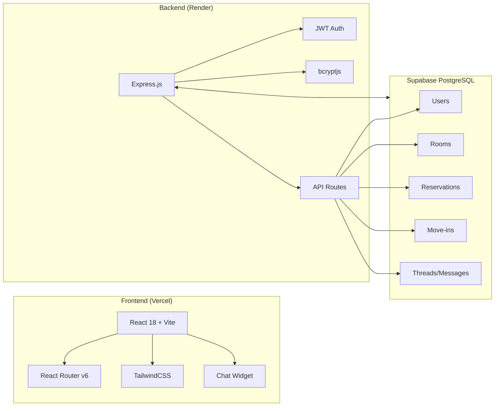

# Windsor Residence - Full Tech Stack Revamp Plan

## Overview

Complete migration from vanilla HTML/CSS/JS to full-stack modern architecture with improvements to features and UX.

**Deployment Target**: Vercel (frontend) + Render (backend)

---

## Architecture Diagram

---

## Todo List

### Phase 1: Project Setup & Backend Foundation

- [ ] Initialize Express.js project with proper structure
- [ ] Set up Supabase PostgreSQL connection
- [ ] Implement JWT authentication middleware
- [ ] Create bcrypt password hashing utilities
- [ ] Set up CORS and environment variables

### Phase 2: Database Schema Migration

- [ ] Design and create Users table schema
- [ ] Design and create Rooms table schema
- [ ] Design and create Reservations table schema
- [ ] Design and create Move-ins table schema
- [ ] Design and create Threads & Messages table schema
- [ ] Write database migration scripts

### Phase 3: Backend API Development

- [ ] Auth routes (register, login, logout, refresh token)
- [ ] User profile routes (get, update)
- [ ] Rooms routes (CRUD, search, filter)
- [ ] Reservations routes (create, get, update status)
- [ ] Move-ins routes (create, get, update)
- [ ] Threads & Messages routes
- [ ] Password reset flow

### Phase 4: Frontend Scaffolding

- [ ] Initialize React 18 + Vite project
- [ ] Configure TailwindCSS with custom theme
- [ ] Set up React Router v6 with route structure
- [ ] Create layout components (Navbar, Footer)
- [ ] Set up authentication context/hooks
- [ ] Create API service layer with interceptors

### Phase 5: Frontend Page Development

- [ ] Home page with room carousel and hero section
- [ ] Search page with map integration and 360° panorama viewer
- [ ] Room detail page
- [ ] Authentication pages (Login, Register, Reset Password)
- [ ] User Profile page
- [ ] My Posts page
- [ ] Inbox/Messages page
- [ ] Threads/Chat page
- [ ] Reserve Rooms page
- [ ] Move-ins page
- [ ] About Us page

### Phase 6: Chat Widget

- [ ] Migrate chat bot to React component
- [ ] Connect to backend for message handling
- [ ] Add chat history persistence
- [ ] UI/UX improvements

### Phase 7: UX Improvements & Polish

- [ ] Add loading states and skeleton screens
- [ ] Implement optimistic UI updates
- [ ] Add toast notifications
- [ ] Improve form validation with real-time feedback
- [ ] Add responsive design optimizations
- [ ] Implement error boundaries
- [ ] Add accessibility improvements (ARIA labels, keyboard nav)

### Phase 8: Deployment Configuration

- [ ] Configure Vercel for frontend deployment
- [ ] Configure Render for backend deployment
- [ ] Set up environment variables on both platforms
- [ ] Test production build
- [ ] Verify domain/CORS configuration

### Phase 9: Testing & Validation

- [ ] Test authentication flow
- [ ] Test room search and booking flow
- [ ] Test messaging functionality
- [ ] Test responsive layouts on all pages
- [ ] Performance testing and optimization

---

## Current Pages → New Route Structure

| Current Page        | New React Route | Component         |
| ------------------- | --------------- | ----------------- |
| home.html           | /               | HomePage          |
| search.html         | /search         | SearchPage        |
| thread.html         | /rooms/:id      | RoomDetailPage    |
| threads.html        | /threads        | ThreadsPage       |
| profile.html        | /profile        | ProfilePage       |
| my-posts.html       | /my-posts       | MyPostsPage       |
| inbox.html          | /inbox          | InboxPage         |
| reserve.html        | /reserve        | ReservePage       |
| move-ins.html       | /move-ins       | MoveInsPage       |
| about-us.html       | /about          | AboutPage         |
| reset-password.html | /reset-password | ResetPasswordPage |
| chat.html           | /chat           | ChatPage          |
| payment.html        | /payment        | PaymentPage       |

---

## Key Improvements to Implement

1. **Authentication**
   - JWT with refresh token rotation
   - Persistent sessions
   - Protected route components

2. **Room Search**
   - Advanced filtering (price, amenities, location)
   - Map integration with Leaflet
   - 360° panorama tours

3. **Messaging System**
   - Real-time message updates
   - Thread-based conversations
   - Unread message indicators

4. **Reservations & Move-ins**
   - Calendar-based availability
   - Status tracking
   - Email notifications (future)

5. **UI/UX**
   - Consistent design system
   - Smooth transitions and animations
   - Mobile-first responsive design
   - Accessibility compliance

---

## Tech Stack Summary

| Layer              | Technology          |
| ------------------ | ------------------- |
| Frontend Framework | React 18            |
| Build Tool         | Vite                |
| Styling            | TailwindCSS         |
| Routing            | React Router v6     |
| Backend Framework  | Express.js          |
| Database           | Supabase PostgreSQL |
| Auth               | JWT + bcryptjs      |
| Frontend Deploy    | Vercel              |
| Backend Deploy     | Render              |
