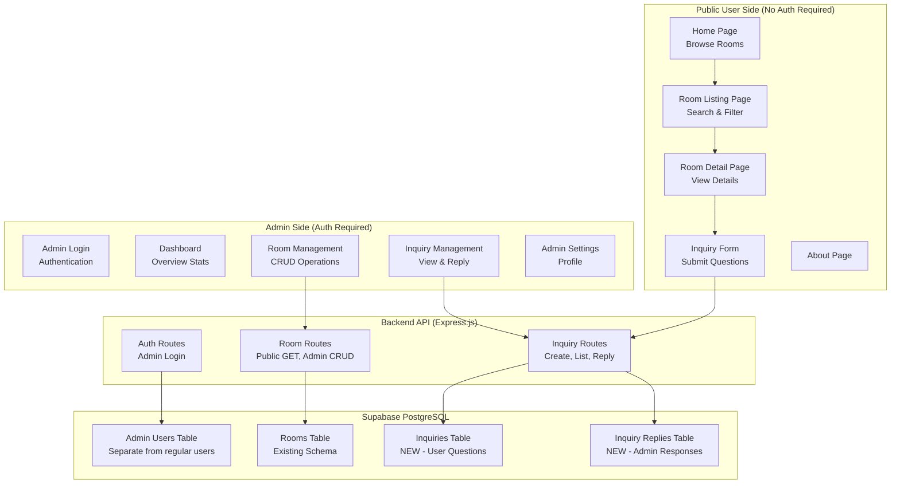

# Windsor Inquiry Website - Revamp Plan

## Overview

Transform the existing residence/room booking platform into a simplified **inquiry-based website** where:

- **Public users** can browse rooms and submit inquiries without registration
- **Admin** can manage rooms and handle user inquiries with replies

---

## Architecture Diagram



---

## Key Changes from Current System

### Removed Features

- User registration (public users)
- User login/authentication (public users)
- User profile management
- Reservations system
- Move-ins tracking
- Thread-based messaging between users

### New Features

- Simplified inquiry form (no auth needed)
- Admin dashboard for managing inquiries
- Direct reply system for admin to respond to inquiries
- Admin-only room management

---

## Database Schema Changes

### New Tables Required

#### 1. `inquiries` Table

```sql
CREATE TABLE inquiries (
    id UUID PRIMARY KEY DEFAULT gen_random_uuid(),
    room_id UUID REFERENCES rooms(id) ON DELETE SET NULL,
    inquirer_name VARCHAR(100) NOT NULL,
    inquirer_email VARCHAR(255) NOT NULL,
    inquirer_phone VARCHAR(20),
    message TEXT NOT NULL,
    status VARCHAR(20) DEFAULT 'pending' CHECK (status IN ('pending', 'replied', 'closed')),
    created_at TIMESTAMP WITH TIME ZONE DEFAULT NOW(),
    updated_at TIMESTAMP WITH TIME ZONE DEFAULT NOW()
);
```

#### 2. `inquiry_replies` Table

```sql
CREATE TABLE inquiry_replies (
    id UUID PRIMARY KEY DEFAULT gen_random_uuid(),
    inquiry_id UUID REFERENCES inquiries(id) ON DELETE CASCADE,
    admin_id UUID REFERENCES admin_users(id) ON DELETE SET NULL,
    message TEXT NOT NULL,
    created_at TIMESTAMP WITH TIME ZONE DEFAULT NOW()
);
```

#### 3. `admin_users` Table (Separate from regular users)

```sql
CREATE TABLE admin_users (
    id UUID PRIMARY KEY DEFAULT gen_random_uuid(),
    email VARCHAR(255) UNIQUE NOT NULL,
    password_hash VARCHAR(255) NOT NULL,
    name VARCHAR(100) NOT NULL,
    is_active BOOLEAN DEFAULT true,
    created_at TIMESTAMP WITH TIME ZONE DEFAULT NOW(),
    updated_at TIMESTAMP WITH TIME ZONE DEFAULT NOW()
);
```

### Tables to Remove/Deprecate

- `users` (or keep for admin only, modify as needed)
- `reservations`
- `move_ins`
- `threads`
- `messages`
- `room_reviews`
- `refresh_tokens`
- `password_reset_tokens`

---

## API Routes

### Public Routes (No Auth)

| Method | Endpoint             | Description                    |
| ------ | -------------------- | ------------------------------ |
| GET    | `/api/rooms`         | List all active rooms          |
| GET    | `/api/rooms/:id`     | Get room details               |
| POST   | `/api/inquiries`     | Submit new inquiry             |
| GET    | `/api/inquiries/:id` | Get inquiry status (via email) |

### Admin Routes (Auth Required)

| Method | Endpoint                         | Description                     |
| ------ | -------------------------------- | ------------------------------- |
| POST   | `/api/admin/auth/login`          | Admin login                     |
| GET    | `/api/admin/rooms`               | List all rooms (incl. inactive) |
| POST   | `/api/admin/rooms`               | Create new room                 |
| PUT    | `/api/admin/rooms/:id`           | Update room                     |
| DELETE | `/api/admin/rooms/:id`           | Delete room                     |
| GET    | `/api/admin/inquiries`           | List all inquiries              |
| PUT    | `/api/admin/inquiries/:id`       | Update inquiry status           |
| POST   | `/api/admin/inquiries/:id/reply` | Reply to inquiry                |
| GET    | `/api/admin/dashboard/stats`     | Dashboard statistics            |

---

## Frontend Pages

### Public Pages (No Auth Required)

| Route        | Page           | Description                         |
| ------------ | -------------- | ----------------------------------- |
| `/`          | HomePage       | Hero + Featured Rooms + Quick Links |
| `/rooms`     | RoomsPage      | Room listings with search/filter    |
| `/rooms/:id` | RoomDetailPage | Room details + Inquiry form         |
| `/about`     | AboutPage      | About Windsor                       |

### Admin Pages (Auth Required)

| Route                   | Page                   | Description             |
| ----------------------- | ---------------------- | ----------------------- |
| `/admin/login`          | AdminLoginPage         | Admin authentication    |
| `/admin`                | AdminDashboardPage     | Overview statistics     |
| `/admin/rooms`          | AdminRoomsPage         | Room CRUD management    |
| `/admin/rooms/new`      | AdminRoomFormPage      | Create new room         |
| `/admin/rooms/:id/edit` | AdminRoomFormPage      | Edit existing room      |
| `/admin/inquiries`      | AdminInquiriesPage     | View all inquiries      |
| `/admin/inquiries/:id`  | AdminInquiryDetailPage | View & reply to inquiry |

---

## Implementation Phases

### Phase 1: Backend Foundation

- [ ] Create new database migration for inquiry schema
- [ ] Create admin_users table and migration
- [ ] Update rooms table (remove owner_id if not needed)
- [ ] Create inquiry and inquiry_replies routes
- [ ] Create admin auth routes
- [ ] Update/remove unused routes (reservations, move-ins, threads, etc.)

### Phase 2: Admin Frontend

- [ ] Create admin layout with sidebar navigation
- [ ] Implement admin login page
- [ ] Create admin dashboard with statistics
- [ ] Build room management pages (list, create, edit)
- [ ] Build inquiry management pages (list, detail, reply)

### Phase 3: Public Frontend

- [ ] Simplify home page (remove auth CTAs)
- [ ] Update room listing page
- [ ] Update room detail page with inquiry form
- [ ] Remove user-related pages (register, profile, inbox, etc.)
- [ ] Update navigation links

### Phase 4: Cleanup & Polish

- [ ] Remove unused code and assets
- [ ] Update environment variables documentation
- [ ] Test full user flow (browse → inquiry → admin reply)
- [ ] Update README and documentation

---

## Security Considerations

1. **Admin Authentication**: Strong password requirements, JWT with short expiration
2. **Inquiry Validation**: Sanitize all user inputs, rate limiting on inquiry submission
3. **File Uploads**: If allowing image uploads for rooms, validate file types and sizes
4. **CORS**: Restrict origins to known domains only
5. **Email Display**: Never expose admin email addresses to public

---

## Migration Strategy

1. **Backup existing data** before migration
2. **Deploy new schema** to Supabase
3. **Implement new backend** routes
4. **Test admin flow** before public release
5. **Deploy new frontend** incrementally
6. **Monitor for issues** and have rollback plan

---

## Questions to Clarify

1. Should existing room data be preserved or cleared?
2. Should there be a contact page for general inquiries (not room-specific)?
3. Should inquiries trigger email notifications to admin?
4. Should there be any moderation queue for inquiries before publishing?
5. What analytics/statistics should the admin dashboard show?
