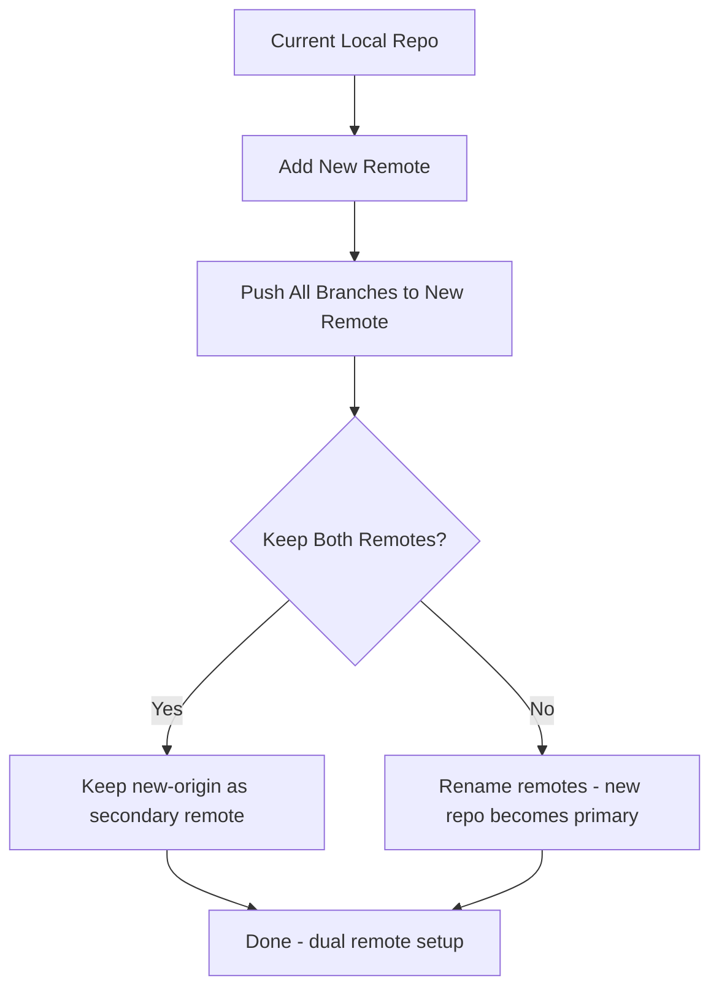

# Plan: Switch Repository to New GitHub Location

## Target Repository

- URL: https://github.com/windsoradmin0-cmd/Windsor

## Workflow Diagram



## Steps

### Step 1: Add New Remote

```bash
git remote add new-origin https://github.com/windsoradmin0-cmd/Windsor.git
```

### Step 2: Push All Branches to New Remote

```bash
git push new-origin --all
```

### Step 3: Push All Tags (if any)

```bash
git push new-origin --tags
```

### Step 4: Replace Origin (Recommended)

```bash
git remote rename origin old-origin
git remote rename new-origin origin
```

## Alternative: Quick Push Without Remote Setup

```bash
git push https://github.com/windsoradmin0-cmd/Windsor.git --all
```

## Verification Commands

```bash
git remote -v          # Check remotes
git branch -a          # List all branches
git log --oneline -5   # Verify commit history
```

## Important Notes

- Ensure you have write access to https://github.com/windsoradmin0-cmd/Windsor
- If the new repo already has content, you may need to force push or merge
- After switching, your `origin` will point to the new repository
