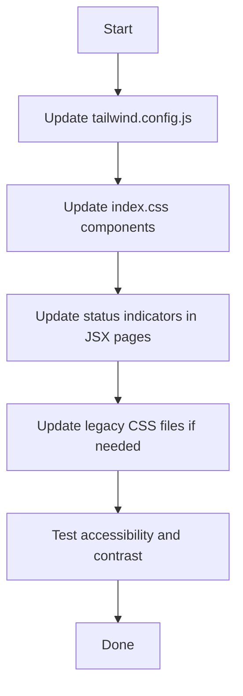

# UI Color Revamp Plan

## Color Mapping

| Role          | Current Color | New Color     | Hex Values     |
| ------------- | ------------- | ------------- | -------------- |
| **Primary**   | Red           | Burgundy/Wine | 650000, 850000 |
| **Secondary** | Green         | Forest Green  | 005841, 003924 |
| **Accent**    | -             | Gold/Amber    | CCB33B, AF9500 |

### Tailwind Shade Mapping

**Primary (Burgundy):**

- 50: `#fef2f2` → `fef6f6`
- 100: `#fee2e2` → `fee8e8`
- 200: `#fecaca` → `fecbcb`
- 300: `#fca5a5` → `fcb5b5`
- 400: `#f87171` → `f88383`
- 500: `#ef4444` → `850000` (base)
- 600: `#dc2626` → `750000`
- 700: `#b91c1c` → `650000`
- 800: `#991b1b` → `550000`
- 900: `#7f1d1d` → `450000`

**Secondary (Forest Green):**

- 50: `#f0fdf4` → `f0fdf7`
- 100: `#dcfce7` → `dcfcea`
- 200: `#bbf7d0` → `bbf7d4`
- 300: `#86efac` → `86efb0`
- 400: `#4ade80` → `4ade84`
- 500: `#22c55e` → `005841` (base)
- 600: `#16a34a` → `004830`
- 700: `#15803d` → `003924`
- 800: `#166534` → `002c1d`
- 900: `#14532d` → `002216`

**Accent (Gold):**

- 50: `faf9e6`
- 100: `f5f2c2`
- 200: `efe996`
- 300: `e8df6b`
- 400: `e1d53f`
- 500: `#CCB33B` (base)
- 600: `#AF9500`
- 700: `8f7600`
- 800: `705900`
- 900: `554300`

---

## Files to Update

### 1. `client/tailwind.config.js`

Update the `colors.primary` and `colors.secondary` objects with new hex values. Add new `colors.accent` object.

### 2. `client/src/index.css`

- Component classes (`btn-primary`, `btn-secondary`, etc.) automatically inherit from Tailwind config
- Error states (`text-red-500`, `border-red-500`, `bg-red-50`) should **remain red** for semantic correctness
- Consider adding `.badge-accent` and `.btn-accent` classes for gold highlights

### 3. React Components - Status Indicators

These currently use `green-*` for "success" and "active" states:

- `client/src/pages/admin/DashboardPage.jsx` - status indicators
- `client/src/pages/admin/InquiriesPage.jsx` - replied/pending/closed statuses
- `client/src/pages/admin/InquiryDetailPage.jsx` - status badges
- `client/src/pages/admin/RoomsPage.jsx` - active/inactive status
- `client/src/pages/AboutPage.jsx` - checkmark icons
- `client/src/pages/MoveInsPage.jsx` - completed/cancelled statuses
- `client/src/contexts/ToastContext.jsx` - success icon (keep green for success semantic)

### 4. Legacy CSS Files (Optional - for older non-React pages)

These files use different color conventions and may be for the older `pages/*.html` versions:

- `css/about-us.css` - primary buttons use `#2e7d32` (green)
- `css/search-page.css` - buttons use `green` and `#2e7d32`
- `css/payment.css` - uses `#006400` (dark green) as primary
- `css/home.css` - simple `green` color for icons
- `css/map.css` - uses `#005c17` for hover states
- `css/map-bot.css` - uses `red` for close button
- `css/reset-password.css` - error text uses `red`

---

## Implementation Sequence

1. **Update `tailwind.config.js`** - Define new color palettes
2. **Update `client/src/index.css`** - Add accent utilities, keep error states red
3. **Update React pages** - Change `green-*` to `secondary-*` for consistency
4. **Update legacy CSS** - Optional, for older pages

---

## Important Notes

### Semantic Colors to Keep Red

- Error messages: `text-red-500`, `bg-red-50`, `border-red-200`
- Error states in forms: `.input-error`
- Delete buttons: destructive actions should remain red
- These are semantic colors that convey "error/danger" - not theming colors

### Status Colors

- Success/Active states should use new `secondary-*` (forest green)
- Pending states can use new `accent-*` (gold) or neutral
- Replied/Closed can remain neutral or use secondary variations

### Gold Accent Usage

The gold colors can be used for:

- Special highlights or featured badges
- Hover states on primary actions
- Warning states (instead of yellow/amber)
- Premium/VIP indicators

---

## Verification Checklist

- [ ] Primary buttons appear in burgundy
- [ ] Secondary buttons appear in forest green
- [ ] Success states show green (not red)
- [ ] Error states still show red
- [ ] Status badges use appropriate colors
- [ ] Accent/gold used for highlights
- [ ] No hardcoded old colors remaining in components
- [ ] Legacy pages (if used) have consistent colors
